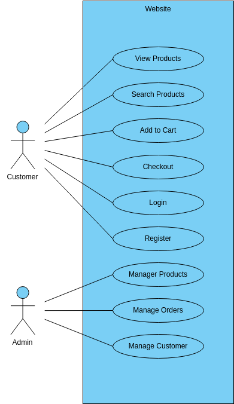

# Requirement Analysis

## 📌 What is Requirement Analysis?

Requirement Analysis is the process of understanding, documenting, and managing the needs and expectations of stakeholders for a new or modified product. It is one of the most critical phases in the Software Development Life Cycle (SDLC).

This process involves gathering requirements from stakeholders, analyzing them to ensure clarity and feasibility, documenting them in a structured format, and validating them with stakeholders to align on the project scope.

Requirement Analysis helps development teams build software that accurately addresses the needs of the users and avoids costly errors later in the project.

---

## 🔍 Why is Requirement Analysis Important?

Requirement Analysis plays a vital role in the success of any software project. Here’s why:

- ✅ **Ensures Clear Understanding of Stakeholder Needs**  
  Captures what users truly want, minimizing misunderstandings and rework.

- ✅ **Reduces Project Risks and Costs**  
  Early identification of conflicting, incomplete, or ambiguous requirements saves time and money during development.

- ✅ **Acts as a Foundation for Design and Development**  
  Serves as a baseline for developers, designers, and testers to align their work with well-defined objectives.

---

## 🔧 Key Activities in Requirement Analysis

Below are the five major activities involved in Requirement Analysis:

- **Requirement Gathering**  
  Collecting information from stakeholders through interviews, surveys, and observation.

- **Requirement Elicitation**  
  Engaging with stakeholders to draw out the actual needs using techniques such as brainstorming, workshops, and prototyping.

- **Requirement Documentation**  
  Structuring requirements into a formal document (e.g., SRS – Software Requirement Specification) for reference and validation.

- **Requirement Analysis and Modeling**  
  Assessing requirements for feasibility, conflicts, and dependencies; often using models like data flow diagrams, use case diagrams, etc.

- **Requirement Validation**  
  Reviewing requirements with stakeholders to ensure they are correct, complete, and aligned with business goals.

---

## 📂 Types of Requirements

### 🔹 Functional Requirements

These define what the system should do — the specific behavior or functions of the system.

**Examples (Booking Management System):**
- Users can search available rooms based on date and location.
- Admins can add, update, or delete room listings.
- The system sends a confirmation email upon successful booking.

### 🔸 Non-functional Requirements

These specify *how* the system performs a function. They cover performance, usability, reliability, etc.

**Examples (Booking Management System):**
- The website should load within 2 seconds on a standard broadband connection.
- The system must be available 99.9% of the time.
- User passwords should be stored in a securely encrypted format.

---

## 🧾 Use Case Diagrams

Use Case Diagrams provide a visual representation of system interactions. They show the different actors involved and the operations they can perform within the system. This makes it easier to identify system boundaries and user needs.

**Benefits:**
- Clarify system functionalities.
- Visualize user interactions.
- Serve as communication tools between stakeholders and developers.

---

## ✅ Acceptance Criteria

Acceptance Criteria are predefined conditions that a software product must meet to be accepted by users, customers, or stakeholders. They define what is acceptable and what is not for a specific feature.

**Importance:**
- Ensures that developers and stakeholders share a common understanding.
- Acts as the basis for test case creation.
- Helps avoid scope creep by clearly defining boundaries.

**Example: Checkout Feature – Acceptance Criteria**
- ✅ The user can proceed to checkout only if at least one room is added to the cart.
- ✅ The checkout page must display booking details: room name, price, taxes, and total.
- ✅ The user must enter valid payment information before confirming the booking.
- ✅ Upon successful payment, a confirmation message and email are sent.

---

> 📁 **Repository**: [requirement-analysis](https://github.com/your-username/requirement-analysis)  
